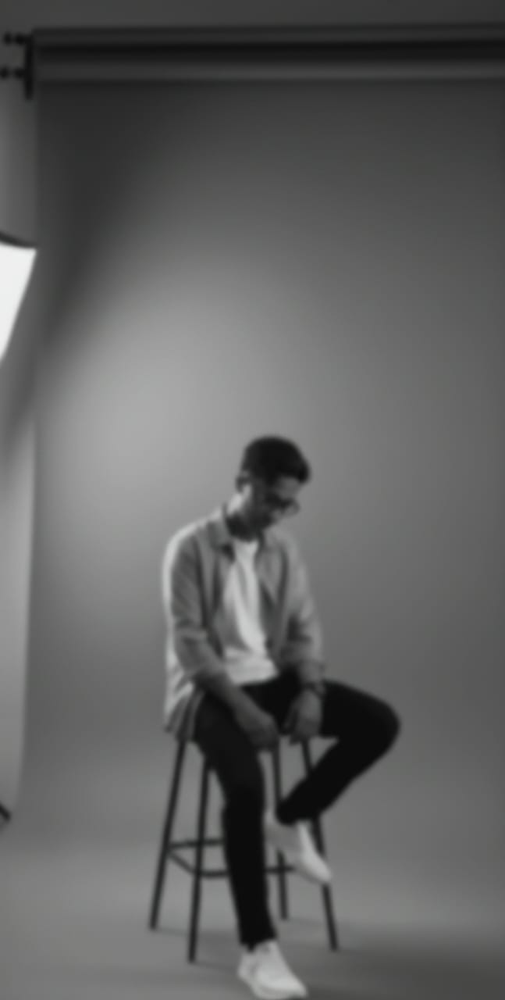

<!-- Header Image -->

  

<!-- Profile Picture -->

  

<!-- Social Badges -->

  
  
  

<!-- Visitor Counter -->

  

---

### About Me
I’m a passionate UI/UX Designer and Application Developer experienced in creating user-centered digital solutions using Flutter, ReactJS, and modern web technologies. I bridge the gap between design and development from prototyping in Figma to building scalable, high performance applications focused on usability. 
With additional experience in market and trading analysis, I bring strong analytical thinking, risk management, and data-driven decision-making to my work. Continuously learning and adapting, I’m eager to contribute to innovative teams in mobile app development, UI/UX design, and web-based systems.

---
<h2 align="center">My Link</h2>

<!-- Custom Badges Section (Vertical Layout) -->

  <!-- GitHub Repository -->
  

  <!-- Blog -->
  

  <!-- WhatsApp -->
  

---

<!-- Copyright Footer -->

  © 2025 <strong>Project13</strong> with by <strong>Iqbal Baharsyah</strong>

